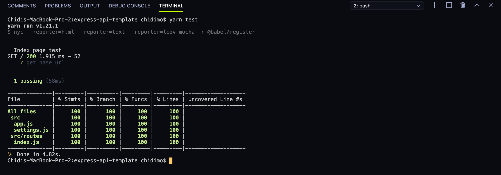

# Express API Template tutorial

## How to set up a backend API project using express (mongodb and postgres)

## Table of content

1. Getting started
1. Installing express
1. Configure version control with `git`
1. Upload to `Github`
1. Generate the express project
1. Remove unnecessary files
1. Running the app
1. Moving to`ES6`
1. Configuring development dependencies: `babel`, `nodemon`, `eslint`, and `prettier`
1. Settings and environment variables. `.env` file.
1. Writing your first test: configure CI/CD, and badges
1. Writing your first controller
1. Writing your first middleware
1. Writing your first model
1. Configure `PostgreSQL`
1. Configure `MongoDB`

## Getting started

The first step is to install node js and initialize a new project. You can check out the node js web page [here].

Open your terminal and create a new directory with the below command

`mkdir express-api-template`

Navigate into the newly created directory with the command

`cd express-api-template`

Now, initialize a new npm project with the command

`npm init`

Answer the questions that follow and when done you have a new javascript project. At this point you have only one file in the folder named `package.json`. This file holds information about your project.

At this point we should add a `README.md` file to my project. So go ahead and create that file at the root of your project. Now you have two files in your folder.

I also like adding a `.editorconfig` file. Read more about it [here](https://editorconfig.org/). If you're using VisualStudio Code there's a plugin that helps you automate the process.

At this point your folder looks like below

```javascript
EXPRESS-API-TEMPLATE/
  .editorconfig
  package.json
  README.md
```

## Installing express

Now it's time to install express. You can read more about express on the official [site](https://expressjs.com/)

On your terminal and still in the project directory, run either of the following commands

`yarn add express`

**Note**: You can either use `yarn` or `npm` as your dependency manager. I've had a smoother experience with yarn, so I'll be using `yarn` throughout this tutorial.

At this point if you check the `package.json` file you'll see express listed as a dependency.

```json
  "dependencies": {
      "express": "^4.17.1",
  }
```

You also get a `node_modules/` folder at the root of your project. This folder is where all the scripts that powers your app are installed.

## Configure version control with `git`

At this point we should configure version control using `git`.

On your terminal and still in the project directory, issue the command

`git init`

This initializes the current folder to use `git` for version control. In a nutshell, version control helps you manage multiple versions of your app.

Next we create a `.gitignore` file. Inside this file we add the names of files and folders that we don't care about keeping track of how they have changed over time. One such folder is the `node_modules` folder.

On your terminal run

`echo node_modules/ > .gitignore`

This creates the `.gitignore` file and writes `node_modules/` in it.

At this point your folder structure looks like below

```javascript
EXPRESS-API-TEMPLATE/
  node_modules/
  .editorconfig
  .gitignore
  package.json
  README.md
  yarn.lock
```

Now commit these files with the following commands in order

`git add .`

`git commit -m "Initial commit"`

## Upload to `Github`

Now head over to [Github](https://github.com). Create an account if you don't have one yet and create a new repository. [Here](https://www.maketecheasier.com/get-started-git-github/) is a short and excellent guide to help you get started.

When creating the repository be sure to uncheck the option **Initialize this repository with a README** as we already have a `README.md` file. The description is optional as well and you can leave the repository as either public or private. Click _Create repository_

On the next page, we will be making use of the second setup option

> **…or push an existing repository from the command line**.
>
> `git remote add origin repo_link`
>
> `git push -u origin master`

Copy the displayed commands one by one and paste them in your terminal

Enter your username and password when prompted for your credentials.

If you have 2-factor authentication on, then go to [Personal access tokens](https://github.com/settings/tokens), generate a new token and use it as your username when prompted for your credentials. Leave the password blank.

## Generate the express project

It's possible to manually set up your server from scratch, but to make our life easier we'll use the express generator. You can learn more about it [here](https://expressjs.com/en/starter/generator.html).
Install it with either of the following commands

`yarn global add express-generator`

To generate the project run the following command

`express -f`

The `-f` flag forces express to create the project in the current directory.

## Remove unnecessary files

Delete the file `index/users.js`. Delete the folders `public/` and `views/`

Rename the file `bin/www` to `bin/www.js`.

Create a new folder named `src/` and move `app.js` file, `bin/` folder, and `routes/` folder inside.

At this point your project folder structure looks like below.

```javascript
EXPRESS-API-TEMPLATE/
  node_modules/
  src/
      bin/
          www.js
      routes/
          index.js
      app.js
  .editorconfig
  .gitignore
  package.json
  README.md
  yarn.lock
```

Open up `package.json` and update the `start` script to look like below

`"start": "node ./src/bin/www"`

Replace the content of `src/app.js` with the below code

```javascript
var logger = require('morgan');
var express = require('express');
var cookieParser = require('cookie-parser');

var indexRouter = require('./routes/index');

var app = express();

app.use(logger('dev'));
app.use(express.json());
app.use(express.urlencoded({ extended: true }));
app.use(cookieParser());

app.use('/', indexRouter);

module.exports = app;
```

Replace the content of `routes/index.js` with the below code

```javascript
var express = require('express');
var router = express.Router();

router.get('/', function(req, res, next) {
  return res.status(200).json({ message: 'Welcome to Express API template' });
});

module.exports = router;
```

## Running the app

To install the project dependencies, run either

`yarn`

To start the app, run either

`yarn start`

If you've set up everything correctly you should only see `$ node ./src/bin/www` on your terminal.

Visit `http://localhost:3000/` in your browser. You should see the following json message

```json
{
  "message": "Welcome to Express API template"
}
```

Commit your changes and push to your Github repo

`git add .`

`git commit -m "run app for first time"`

`git push`

## Moving to`ES6`

The default code is written in ES5 and in this tutorial we're going to be using `ES6`. The first step is to convert our already existing code to `ES6`. We're going to be using a lot of arrow functions as well, so brace yourself.

Replace the content of `routes/index.js` with the below code

```javascript
import express from 'express';

const indexRouter = express.Router();

indexRouter.get('/', (req, res) =>
  res.status(200).json({ message: 'Welcome to Express API template' })
);

export default indexRouter;
```

Replace the content of `src/app.js` with the below code

```javascript
import logger from 'morgan';
import express from 'express';
import cookieParser from 'cookie-parser';

import indexRouter from './routes/index';

const app = express();

app.use(logger('dev'));
app.use(express.json());
app.use(express.urlencoded({ extended: true }));
app.use(cookieParser());

app.use('/', indexRouter);

export default app;
```

Replace the content of `bin/www.js` with the below code

```javascript
#!/usr/bin/env node

/**
 * Module dependencies.
 */

// const debug = require('debug')('quick-credit:server');

import debug from 'debug';
import http from 'http';
import app from '../app';

/**
 * Normalize a port into a number, string, or false.
 */

const normalizePort = val => {
  const port = parseInt(val, 10);

  if (Number.isNaN(port)) {
    // named pipe
    return val;
  }

  if (port >= 0) {
    // port number
    return port;
  }

  return false;
};

/**
 * Get port from environment and store in Express.
 */

const port = normalizePort(process.env.PORT || '3000');
app.set('port', port);

/**
 * Create HTTP server.
 */

const server = http.createServer(app);

/**
 * Event listener for HTTP server "error" event.
 */

const onError = error => {
  if (error.syscall !== 'listen') {
    throw error;
  }

  const bind = typeof port === 'string' ? `Pipe ${port}` : `Port ${port}`;

  // handle specific listen errors with friendly messages
  switch (error.code) {
    case 'EACCES':
      alert(`${bind} requires elevated privileges`);
      process.exit(1);
      break;
    case 'EADDRINUSE':
      alert(`${bind} is already in use`);
      process.exit(1);
      break;
    default:
      throw error;
  }
};

/**
 * Event listener for HTTP server "listening" event.
 */

const onListening = () => {
  const addr = server.address();
  const bind = typeof addr === 'string' ? `pipe ${addr}` : `port ${addr.port}`;
  debug(`Listening on ${bind}`);
};

/**
 * Listen on provided port, on all network interfaces.
 */

server.listen(port);
server.on('error', onError);
server.on('listening', onListening);
```

At this point all our existing code is in ES6 syntax. If you try to start the server with `yarn start`, you'll get a syntax error message in your terminal. This is where babel comes in. We'll be using various babel scripts in this project.

## Configuring development dependencies: `babel`, `nodemon`, `eslint`, and `prettier`

It's time to setup all the babel scripts we're going to need for this project. I'll also take the liberty of setting up a few extra scripts that will make our lives easier

Copy the line below and paste it into your terminal.

`yarn add @babel/cli @babel/core @babel/plugin-transform-runtime @babel/preset-env @babel/register @babel/runtime @babel/node --dev`

This installs all the listed babel scripts as development dependencies. Check your `package.json` file and you should see a key `devDependencies`. All the installed scripts will be listed there.

The babel scripts we're using are explained below

1. `@babel/cli` - Allows the use of Babel from the terminal. Available as ./node_modules/.bin/babel. Used in build script.
1. `@babel/core` - core Babel functionality. This is a required installation.
1. `@babel/node` - works exactly the same as the Node.js CLI, with the added benefit of compiling with Babel presets and plugins before running it. Required for use with nodemon as `nodemon --exec babel-node ./src/bin/www`. This forces nodemon to run `babel-node ./src/bin/www.js` instead of running the start script.
1. `@babel/plugin-transform-runtime` - helps avoid duplication in compiled output
1. `@babel/preset-env` - collection of plugins. Plugins are responsible for carrying out code transformations
1. `@babel/register` - compile files on the fly. Specified as a requirement during tests.
1. `@babel/runtime` - works in conjunction with `@babel/plugin-transform-runtime`

Create a file named `.babelrc` at the root of your project and add the following code

```babel
{
    "presets": ["@babel/preset-env"],
    "plugins": ["@babel/transform-runtime"]
}
```

Now install `nodemon` with the line below. Nodemon helps us with automatic server restart when we have changes in our file.

`yarn add nodemon --dev`

Create a file `nodemon.json` and add the code below

```json
{
  "watch": [
    "package.json",
    "nodemon.json",
    ".eslintrc.json",
    ".babelrc",
    "src/"
  ],
  "verbose": true,
  "ignore": ["*.test.js", "*.spec.js"]
}
```

The `watch` key tells `nodemon` which files and folders to watch for changes.

Now add the below line to the `scripts` section of your `package.json` file

`"devstart": "set NODE_ENV=development&set DEBUG=dev&nodemon --exec babel-node ./src/bin/www"`

From now on we will be running the server on our local machine with the `devstart` command.

Run `yarn devstart` and visit `http://localhost:3000/`. You should our server is up and running. Hurray.

One last step in this section. Let's configure ESLint and prettier. Add both of them with the command below. You should run this on a separate terminal while observing the terminal where our server is running. You should see the server restarting. This is because we're monitoring `package.json` file for changes.

`yarn add eslint eslint-config-airbnb-base eslint-plugin-import prettier --dev`

Now create the file name `eslintrc.json` and add the below code

```json
{
  "env": {
    "browser": true,
    "es6": true,
    "node": true,
    "mocha": true
  },
  "extends": ["airbnb-base"],
  "globals": {
    "Atomics": "readonly",
    "SharedArrayBuffer": "readonly"
  },
  "parserOptions": {
    "ecmaVersion": 2018,
    "sourceType": "module"
  },
  "rules": {
    "indent": ["warn", 2],
    "linebreak-style": ["error", "unix"],
    "quotes": ["error", "single"],
    "semi": ["error", "always"],
    "no-console": 1,
    "comma-dangle": [0],
    "arrow-parens": [0],
    "object-curly-spacing": ["warn", "always"],
    "array-bracket-spacing": ["warn", "always"],
    "import/prefer-default-export": [0]
  }
}
```

Create a file named `.prettierrc` and add the code below

```json
{
  "trailingComma": "es5",
  "tabWidth": 2,
  "semi": true,
  "singleQuote": true
}
```

Add the following scripts to your `package.json`

`"lint": "./node_modules/.bin/eslint ./src"`

`"pretty": "prettier --write '**/*.{js,json}' '!node_modules/**'"`,

`"postpretty": "yarn lint --fix"`

Run `yarn lint`. You should see a number of errors and warnings in the console.

The `pretty` command prettifies our code. The `postpretty` command is run immediately after. It runs the `lint` command with the `--fix` flag appended. This helps to fix common linting issues automatically. In this way I mostly just run the `pretty` command without bordering about the `lint` command.

Run `yarn pretty`. You should see that we have only two warnings about the presence of `alert` in the `bin/www.js` file.

Here's what out project structure looks like at this point

```javascript
EXPRESS-API-TEMPLATE/
  node_modules/
  src/
      bin/
          www.js
      routes/
          index.js
      app.js
  .babelrc
  .editorconfig
  .eslintrc.json
  .gitignore
  .prettierrc
  nodemon.json
  package.json
  README.md
  yarn-error.log
  yarn.lock
```

Add `yarn-error.log` to `.gitignore` file. Commit your changes and push to Github.

`git add .`

`git commit -m "configure dev dependencies"`

`git push`

## Settings and environment variables. `.env` file

You should have your server running

In almost every project there will come a time when you must have a place to hold global settings that will be used throughout your app. Say for example you want to use an AWS secret. You can treat this as a setting that will be placed in a file so you can use it anywhere in your file.

For this purpose I use a `settings.js` file at the root of my project. Some people may prefer `config.js`, but coming from a python background `settings.js` feels more natural to me.

Oftentimes the variables in your settings file will come from environment variables. For security reasons, we never keep things like API keys in a place where more than one person has access. To make this feasible we make use of a `.env` file. This file only exists in your local machine. It holds all your API keys and secrets.

Go ahead and create the `.env` file at the root of your project and `settings.js` file inside the `src/` folder. Add the `.env` file to the `.gitignore` and `nodemon.json` files.

Inside the `.env` file add the following

`TEST_ENV_VARIABLE="Environment variable is coming across"`

To be able to read the `.env` file we make use of the `dotenv` package. Go ahead and install it with

`yarn add dotenv`

Note that this package is also needed in production.

Open up `settings.js` and add the below code

```javascript
import dotenv from 'dotenv';

dotenv.config();

export const testEnvironmentVariable = process.env.TEST_ENV_VARIABLE.trim();
```

The `trim()` method helps to remove any extraneous spaces around the value of the variable.

At this point you may notice `ESLint` raises the _Prefer default export_ warning in `settings.js` file. Go ahead and add the following line under the `rules` key of your `eslintrc.json` file.

`"import/prefer-default-export": [0]`

We're gonna see this environment variable in the browser. Go ahead and edit `src/index.js` to look like below

```javascript
import express from 'express';

import { testEnvironmentVariable } from '../settings';

const indexRouter = express.Router();

indexRouter.get('/', (req, res) =>
  res.status(200).json({ message: testEnvironmentVariable })
);

export default indexRouter;
```

Now visit `http://localhost:3000/`. You should see this

```json
{
  "message": "Environment variable is coming across"
}
```

And that's it. From now on we can add as many environment variables as we want and we can read all of them inside our settings file.

Now prettify and lint with the `yarn pretty` command.

Here's what out project structure looks like at this point

```javascript
EXPRESS-API-TEMPLATE/
  node_modules/
  src/
      bin/
          www.js
      routes/
          index.js
      app.js
      settings.js
  .babelrc
  .editorconfig
  .env
  .eslintrc.json
  .gitignore
  .prettierrc
  nodemon.json
  package.json
  README.md
  yarn-error.log
  yarn.lock
```

Commit your changes and push to github.

## Writing your first test: configure CI/CD, and badges

It's time to write our first test. In our tests, we will be make calls to our API endpoints and check what is returned to be sure it's what we expect. We will be making use of the following tools.

1. `mocha` - test runner
1. `chai` - used to make assertions
1. `nyc` - collect test coverage report
1. `sinon` - for spying, stubbing, and mocking
1. `sinon-chai` - extends chai's assertions
1. `supertest` - used to make http calls to our API endpoints
1. `coveralls` - for uploading test coverage to <https://coveralls.io>

Copy and paste the code below into your terminal and run it.

`yarn add mocha chai sinon nyc sinon-chai supertest coveralls -D`

Create a new folder called `test` at the root of your project. `mocha` finds and executes this file automatically. Create two files inside the `test/` folder: `test/setup.js` and `test/index.test.js`.

Add a new `test` entry to the scripts section of our package.json file.

Open up `test/setup.js` and paste the below code. This is just a helper file that helps us organize all the imports we need in our test files.

```javascript
import supertest from 'supertest';
import chai from 'chai';
import sinonChai from 'sinon-chai';

import app from '../src/app';

chai.use(sinonChai);

export const { expect } = chai;
export const server = supertest.agent(app);
export const BASE_URL = '/';
```

Open up `index.test.js` and paste the following code. Here we simply request the base endpoint, which is `/` and assert that the body object has a `message` key with a value of `Environment variable is coming across.`

```javascript
import { expect, server, BASE_URL } from './setup';

describe('Index page test', () => {
  it('get base url', done => {
    server
      .get(`${BASE_URL}`)
      .expect(200)
      .end((err, res) => {
        expect(res.status).to.equal(200);
        expect(res.body.message).to.equal(
          'Environment variable is coming across.'
        );
        done();
      });
  });
});
```

`"test": "nyc --reporter=html --reporter=text --reporter=lcov mocha -r @babel/register"`

Now run `yarn test`. You should see a test report in your terminal that looks similar to the picture below.



Two additional folders are generated: `.nyc_output/` and `coverage/`. Add both to your `.gitignore` file. I encourage you to take a look inside the `coverage/` folder, open up `coverage/index.html` in a browser and see test report for each file.
